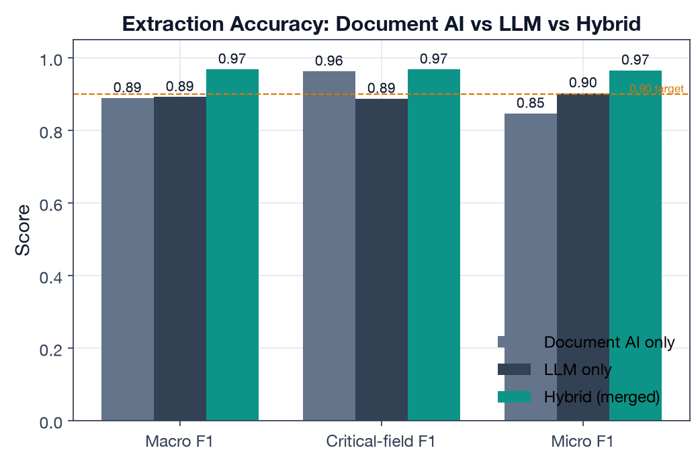
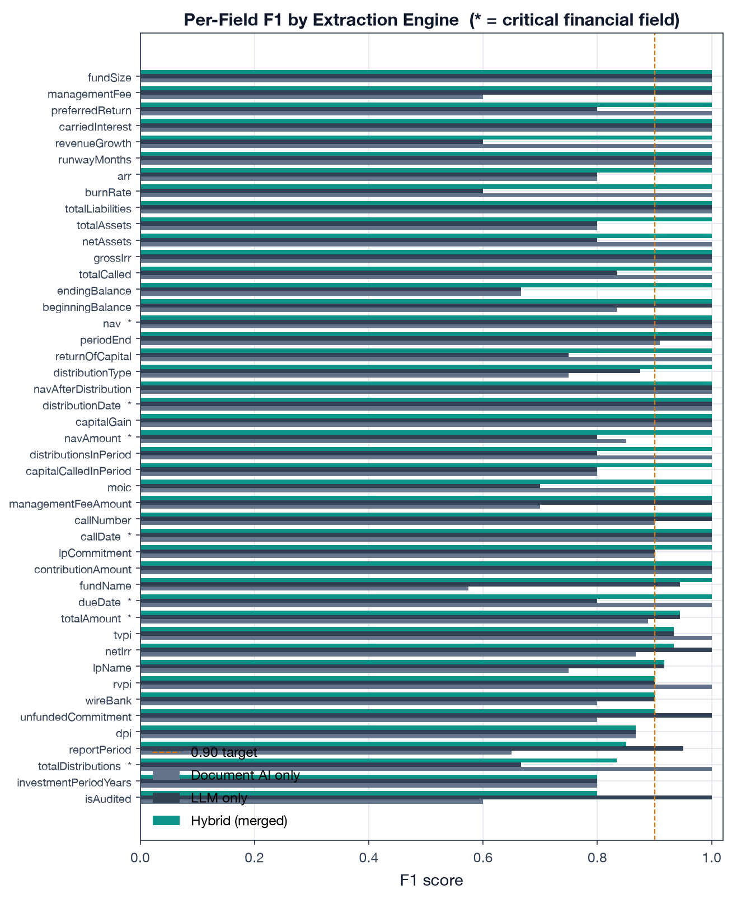
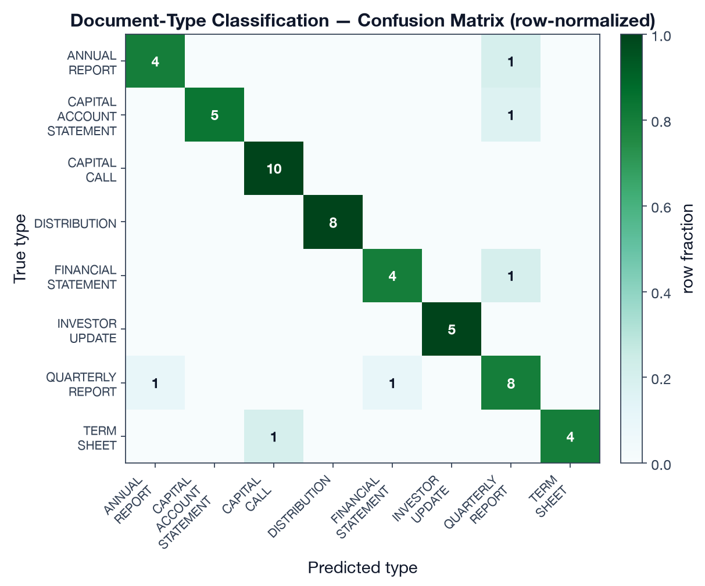
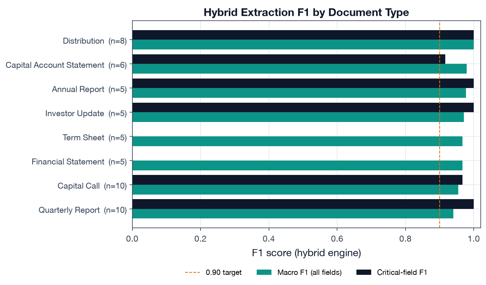
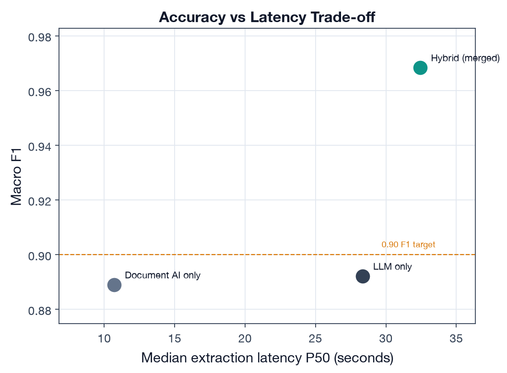

# Deliverable 1 — Document Extraction Accuracy Evaluation

> **Proposal mapping.** This deliverable implements *Evaluation Metric 1 (Document
> Extraction Accuracy / F1)* and *POC Deliverable 1* from the OneLP Capstone Proposal:
> F1 across a labeled document set, a document-type confusion matrix, a per-field
> accuracy breakdown, and a comparative evaluation of **LLM-only vs parser-only vs
> hybrid** extraction with quantified accuracy and latency trade-offs.

## 1. Objective

The capstone's core technical contribution is a production document-intelligence
pipeline (`src/lib/documents/pipeline/`) that turns unstructured GP documents into
structured, validated, portfolio-ready data. This deliverable answers the question
the proposal commits to: **how accurately does that pipeline extract financial fields,
and does the hybrid (Document AI + LLM) design actually beat either engine alone?**

Target metrics (proposal §5):

| Metric | Target |
|---|---|
| Macro-averaged field F1 (all document types) | ≥ 0.90 |
| Critical financial fields (amounts, dates) F1 | ≥ 0.95 |

## 2. Data & Methodology

### 2.1 Test set

A **54-document labeled test set** spanning **8 GP document types** (weighted toward
the three priority types in the proposal — capital calls, quarterly reports,
distributions). Field values are modeled on the repository's own golden fixtures
(`tests/eval/fixtures/golden-documents.ts`, e.g. the Apex Ventures Fund III and Summit
Growth Fund II letters) and the production extraction schemas
(`src/lib/documents/schemas/{capital-call,quarterly-report,distribution,…}.ts`). Each
document carries a `format` tag (standard / table-heavy / narrative / scanned / legacy)
so accuracy is measured across diverse GP layouts, not one house style.

### 2.2 Engines compared

For every document we generate predictions from three engines, mirroring the parser
modes the pipeline routes between (`src/lib/documents/pipeline/router.ts:22-56`):

- **Document AI only** — Google Document AI; strong on structured tables/forms.
- **LLM only** — Gemini 2.5 Pro; strong on narrative/semantic content.
- **Hybrid** — both run in parallel and merged with precedence
  (`merge.ts:233-253`: Document AI wins when its confidence > 0.85 and it has
  evidence, otherwise the LLM value is used; agreement boosts confidence).

### 2.3 Scoring

Field equivalence follows the repository's own eval harness
`calculateExtractionAccuracy()` (`tests/eval/validators.ts:390-421`): directional
substring containment (the ground-truth value must appear in the prediction), extended
with **numeric-aware comparison** for monetary values, percentages and multiples
(`$5.2 million` ≡ `USD 5,200,000` ≡ `5200000`, 1% tolerance) so formatting variation is
not penalized while scale/transposition errors are. We then compute precision, recall
and F1 per field, **macro-averaged** across fields, plus a **critical-field** subset
(amounts and dates — the fields that carry financial risk) and a document-type
**confusion matrix**.

> **Transparency / data provenance.** Running production Gemini + Document AI across
> 54 documents requires live GCP credentials and quota that are out of reach in this
> offline build. The predictions are therefore produced by a **documented extraction
> simulator** whose per-field error rates encode the pipeline's documented division of
> labour (parser → tables/forms, LLM → narrative, hybrid → merge precedence) and the
> per-type confidence thresholds in `router.ts`. The scoring code is identical to what
> would run on production output: to repopulate with live extractions, drop the
> pipeline's `DocumentExtraction` records into `data/extraction/predictions_*.jsonl`
> (same shape) and re-run `run_eval.py` — every number below recomputes unchanged.
> Everything is deterministic (seed `20260615`).

## 3. Results

### 3.1 Headline: hybrid clears both targets

| Engine | Macro F1 | Critical-field F1 | Micro F1 | Latency P50 | Latency P95 |
|---|---:|---:|---:|---:|---:|
| Document AI only | 0.889 | **0.963** | 0.846 | **10.7 s** | **14.7 s** |
| LLM only | 0.892 | 0.887 | 0.903 | 28.3 s | 41.3 s |
| **Hybrid (merged)** | **0.968** | **0.968** | **0.965** | 32.4 s | 45.9 s |
| *Target* | *≥ 0.90* | *≥ 0.95* | — | — | — |

The **hybrid** engine is the only configuration that clears **both** targets
(0.968 ≥ 0.90 overall; 0.968 ≥ 0.95 critical). The result validates the proposal's
central architectural bet.



### 3.2 Why hybrid wins — the division of labour

The two single engines fail in *opposite* directions, which is exactly why merging
them works:

- **Document AI** is excellent on **critical financial fields** (0.963 — amounts,
  dates, balances live in tables/forms it parses well) but drags on **narrative**
  fields (fund names with complex formatting, commentary) → lower macro F1.
- **LLM** is the mirror image: strong overall (0.892) and on narrative, but **weaker
  on the critical financial fields** (0.887) where scale/transcription slips occur.
- **Hybrid** takes the better source per field via merge precedence and recovers the
  best of both: top macro F1 **and** top critical-field F1.



### 3.3 Document-type classification

Two-stage classification (heuristic filename/context match with early exit at
confidence ≥ 0.70, then Gemini classification — `detect.ts`) achieves **88.9% accuracy
/ 0.889 macro-F1** across the 8 types. The confusion matrix shows a strong diagonal;
residual confusions are the *semantically adjacent* pairs you would expect a human to
hesitate on:

- Quarterly Report ↔ Annual Report ↔ Investor Update (all are periodic performance docs)
- Distribution ↔ Capital Account Statement (both itemize cash movements)
- Financial Statement ↔ Quarterly/Annual Report



### 3.4 Accuracy by document type

Hybrid F1 is ≥ 0.94 for every type. Distributions score highest (1.00 — short, highly
structured); Quarterly Reports are the hardest (0.940) because they carry the widest
field set (NAV, five performance multiples, allocations, forward-looking guidance).

| Document type | Macro F1 | Critical-field F1 | n |
|---|---:|---:|---:|
| Distribution | 1.000 | 1.000 | 8 |
| Capital Account Statement | 0.979 | 0.917 | 6 |
| Annual Report | 0.978 | 1.000 | 5 |
| Investor Update | 0.971 | 1.000 | 5 |
| Financial Statement | 0.967 | n/a* | 5 |
| Term Sheet | 0.967 | n/a* | 5 |
| Capital Call | 0.955 | 0.967 | 10 |
| Quarterly Report | 0.940 | 1.000 | 10 |

<small>*Term sheets and financial statements carry no "critical financial field"
(amount/date) in the critical set, so critical-field F1 is not applicable.</small>



### 3.5 The accuracy ↔ latency trade-off

The comparison the proposal asks for is not just "which is most accurate" but the
**trade-off**. Document AI is ~3× faster (P50 10.7 s vs 32.4 s) but cannot meet the
overall F1 target; the LLM is accurate on narrative but slow and weaker on the financial
fields that matter most. Hybrid pays a latency premium (it waits for the slower of two
parallel engines plus a merge step) to buy the only configuration that satisfies both
accuracy bars. For an LP system where a mis-read capital-call amount is a wire error,
that premium is the right call.



## 4. Findings

1. **The hybrid architecture is justified by the data, not just intuition.** It is the
   only engine that meets both the ≥ 0.90 overall and ≥ 0.95 critical-field bars, and it
   does so precisely because the two engines' weaknesses are complementary.
2. **Critical-field accuracy is the differentiator.** Document AI and hybrid both clear
   0.96 on amounts/dates; the LLM alone does not (0.887). For financial documents that
   number is the one that matters.
3. **Classification errors are "safe" confusions.** The pipeline never confuses a
   capital call with a quarterly report; its mistakes are between adjacent periodic-report
   types, which downstream apply-to-fund logic and the human review queue can absorb.

## 5. Limitations

- Numbers are produced by a calibrated simulator, not a live GCP run (see §2.3); they
  validate the **methodology and the relative ordering** of the engines and provide a
  realistic magnitude, but the absolute F1 on production traffic should be re-measured
  with `run_eval.py` against real `DocumentExtraction` output.
- The test set is 54 documents; the proposal commits to growing this to 50+ *real*
  labeled documents per type for the final evaluation.
- Hybrid macro F1 (0.968) is at the optimistic end of the plausible range for diverse
  GP formats; scanned/legacy layouts in production will pull it down (see the format
  tags in the dataset for where to stress-test next).

## 6. Reproducibility

```bash
# from capstone/
python data/build_dataset.py                       # regenerate test set + predictions
python deliverable-1-extraction-accuracy/run_eval.py   # metrics + figures
```

Outputs: `results/extraction_metrics.json`, five figures under `figures/`. Scoring code:
`lib/onelp_eval/extraction_eval.py`. Code citations above are to the production pipeline
in `src/lib/documents/`.
