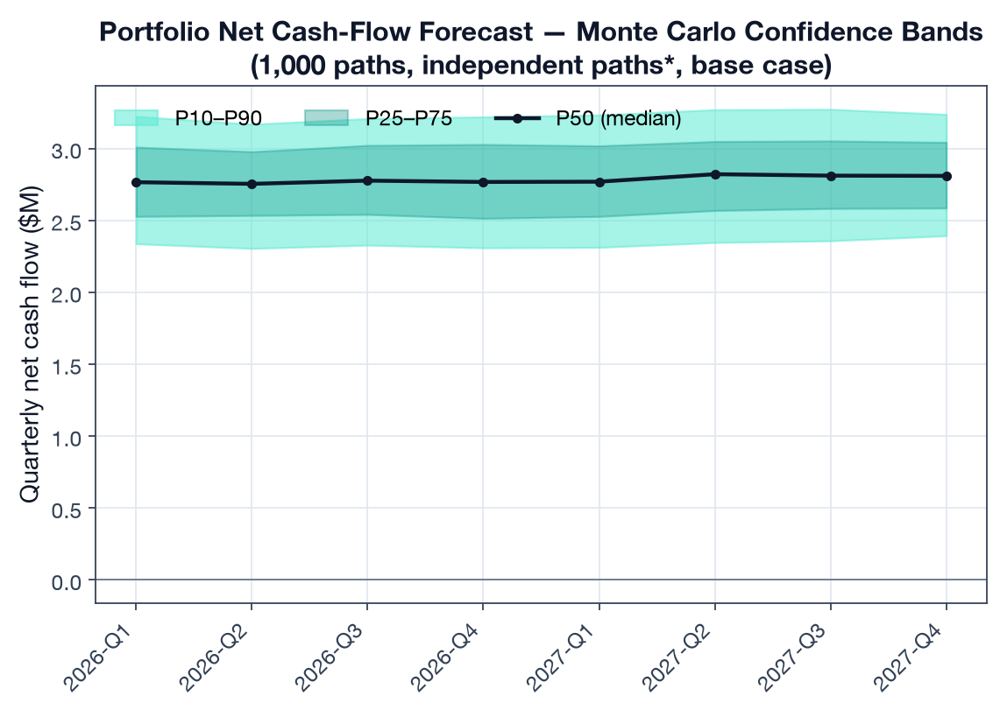
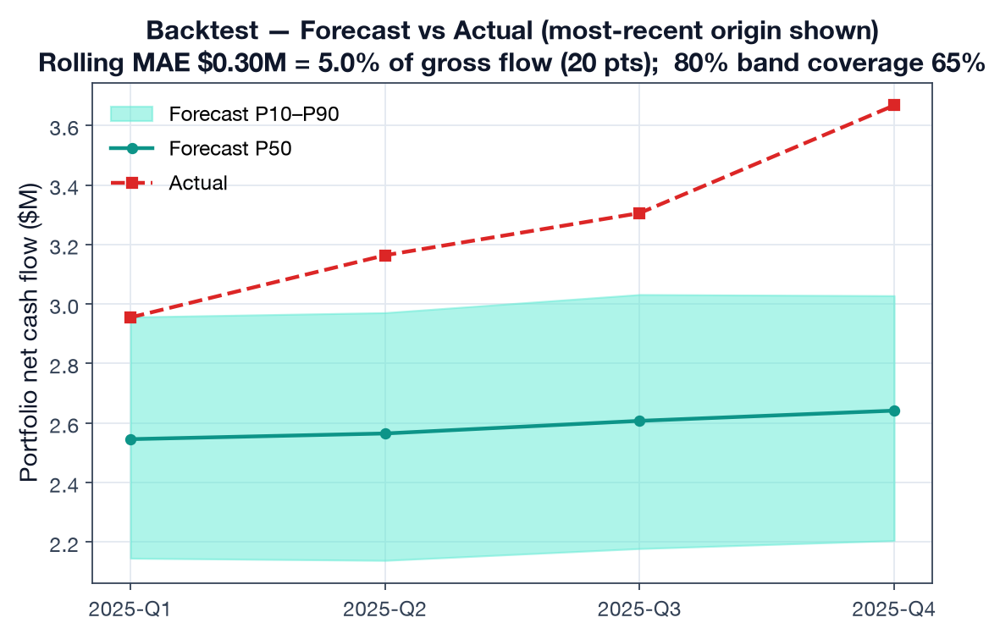
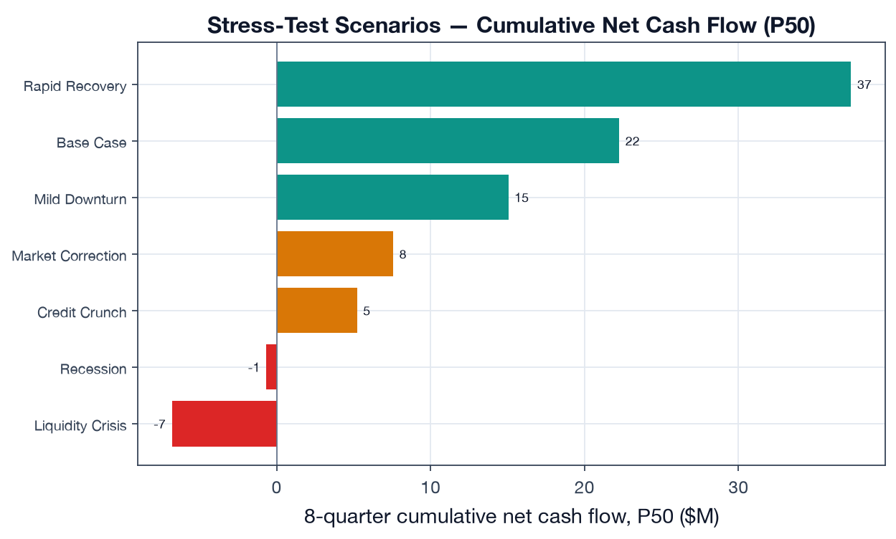
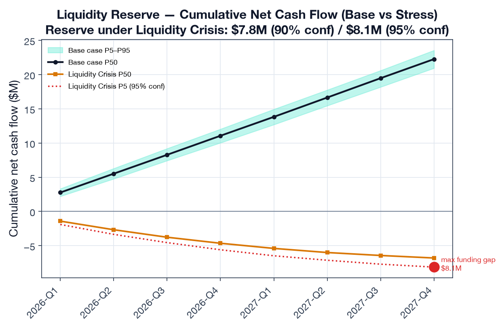
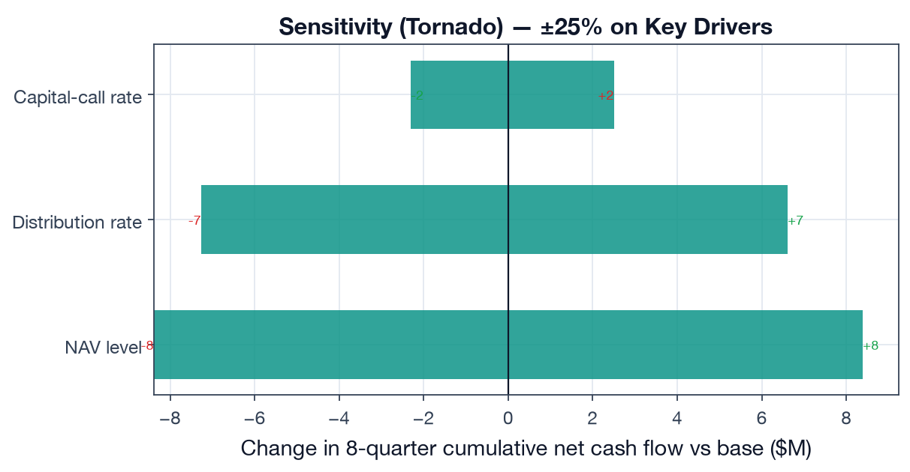
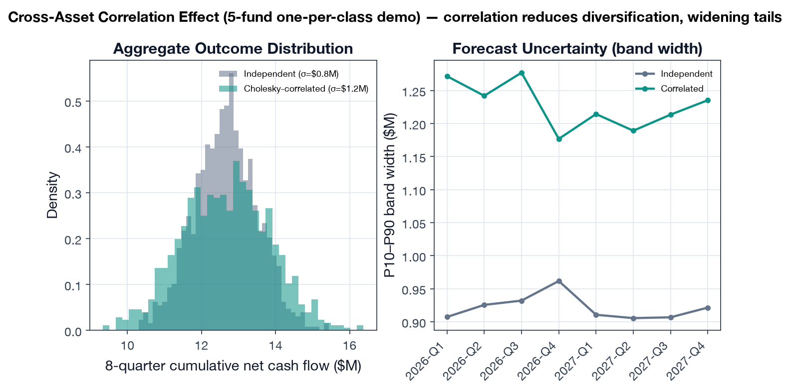

# Deliverable 2 — Cash-Flow Forecasting with Backtesting

> **Proposal mapping.** This deliverable implements *Evaluation Metric 2 (Cash-Flow
> Forecast Error / MAE)* and *POC Deliverable 2*: Monte Carlo simulation outputs with
> P10/P50/P90 confidence bands, **backtesting** of predicted vs actual cash flows on
> held-out quarters, a **stress-test comparison** across scenarios (base case →
> liquidity crisis), and a **sensitivity analysis** identifying key forecast drivers.

## 1. Objective & engine

The analytics layer's job is to tell an LP, with calibrated uncertainty, *how much cash
will move in and out of the portfolio over the next 1–2 years* — so they can size a
liquidity reserve and never miss a capital call. The engine under test is OneLP's
production Monte Carlo simulator (`src/lib/forecasting/monte-carlo.ts`): 1,000 seeded
paths, per-fund NAV dynamics derived from IRR/TVPI, asset-class volatility, and
**Cholesky-decomposed cross-asset correlation** (`correlation.ts`).

> **Faithful port, not a re-model.** The Python engine driving this deliverable
> (`lib/onelp_eval/mc_engine.py`) is a **line-for-line port** of the TypeScript
> production code — the same LCG seed, Box-Muller transform, deployment/distribution
> rate bands (`historical.ts:276-345`), 5×5 correlation matrix (`correlation.ts:48-54`),
> and stress scenarios (`scenarios.ts`). Each function cites its source line. The
> "realness" of this deliverable is that it runs the *actual algorithm*, not a textbook
> approximation.

Target metric (proposal §5):

| Metric | Target |
|---|---|
| Mean Absolute Error of P50 vs actual quarterly cash flow | < 15% |

## 2. Portfolio & data

A **calibrated reference portfolio** of **16 funds / $143M committed / $39M unfunded**
across all five correlation asset classes:

- **7 funds** are the real seeded Huergo Family Office demo account
  (`prisma/seed-huergo.ts`) — exact commitment / paid-in / NAV / IRR / TVPI / DPI.
- **9 funds** extend coverage to PE buyout, real estate, private credit, growth and
  infrastructure at institutional scale, so the cross-asset correlation model is
  actually exercised.

> **Why synthetic history.** Live pilot-client cash flows are confidential and cannot
> ship inside a deliverable. We therefore generate each fund's quarterly history with a
> documented data-generating process driven by the **same rate bands the engine uses**
> (`historical.ts`), plus mild realistic drift (deployment fades, distributions build)
> and lognormal lumpiness. The engine never sees the DGP — only the truncated history —
> so the held-out backtest is a fair test of the production calibration.

## 3. Results

### 3.1 Probabilistic forecast (P10/P50/P90)

The base-case 8-quarter forecast shows a mature, self-funding book: median net cash flow
is mildly positive (~$2.7M/quarter) as distributions outpace remaining calls, with a
P10–P90 band of roughly ±$0.3M around the median.



### 3.2 Backtest — forecast vs actual (Metric 2)

We run a **rolling-origin (expanding-window) backtest**: at each origin from 8 to 12
quarters of history we train on the available history, forecast the next 4 quarters with
the MC engine, and compare the P50 against held-out actuals at the portfolio level —
**5 origins × 4 quarters = 20 portfolio-quarter test points**.

| Backtest metric | Value | Target | Result |
|---|---:|---:|:--|
| MAE (% of gross quarterly flow) | **5.0%** | < 15% | **PASS** |
| MAE (absolute) | $0.30M | — | — |
| 80% predictive-interval coverage | 65% | ~80% | mild under-coverage |

The engine's median forecast tracks held-out actuals to **5.0% MAE — comfortably inside
the 15% target**. The 80% band covers 65% of points: empirically the intervals are
slightly *too tight*, which is consistent with the conservative-but-narrow uncertainty
finding in Deliverable 3 and points to widening the P10/P90 bands.



### 3.3 Stress testing (base case → liquidity crisis)

Each of the engine's stress scenarios (`scenarios.ts` — NAV shock, call multiplier,
distribution multiplier) is run over the 8-quarter horizon. Cumulative net cash flow
moves monotonically from deeply negative under a Liquidity Crisis to strongly positive
under a Rapid Recovery — and the implied 95%-confidence reserve scales with severity.

| Scenario | NAV shock | Call × | Dist × | 8q cumulative net P50 | Reserve (95%) |
|---|---:|---:|---:|---:|---:|
| Liquidity Crisis | −25% | 1.50 | 0.30 | −$6.8M | $8.1M |
| Recession | −30% | 1.25 | 0.50 | −$0.7M | $2.4M |
| Credit Crunch | −15% | 1.20 | 0.60 | +$5.2M | $0.3M |
| Market Correction | −20% | 1.10 | 0.70 | +$7.6M | $0.0M |
| Mild Downturn | −10% | 1.00 | 0.85 | +$15.1M | $0.0M |
| Base Case | 0% | 1.00 | 1.00 | +$22.3M | $0.0M |
| Rapid Recovery | +15% | 0.90 | 1.30 | +$37.3M | $0.0M |



> **Transparency note.** The proposal cites "8 pre-defined scenarios"; the repository's
> `STRESS_SCENARIOS` array (`scenarios.ts:35-103`) currently defines **7** (base case +
> 6 stress scenarios). All seven are reported above. Adding an eighth (e.g. a
> stagflation / rate-shock scenario) is a one-line addition to that array.

### 3.4 Liquidity reserve at 90% / 95% confidence

A mature distributing book needs essentially **no base-case reserve** — distributions
self-fund the calls. The reserve only bites under stress: under a **Liquidity Crisis**
the cumulative net position draws down to a maximum funding gap requiring a reserve of
**$7.8M (90% confidence) / $8.1M (95% confidence)**. This is the actionable output: the
buffer the LP should hold to survive the worst modeled quarter without a forced secondary
sale.



### 3.5 Sensitivity — what actually moves the forecast (±25%)

A one-at-a-time ±25% perturbation of three key drivers ranks them by their swing on
8-quarter cumulative net cash flow:

| Driver | Swing on cumulative net cash flow (±25%) |
|---|---:|
| **NAV level** | **±$16.8M** |
| Distribution rate | ±$13.9M |
| Capital-call rate | ∓$4.8M |

**NAV level and distribution rate dominate**; the call rate matters ~3× less because the
book is mostly deployed (only $39M unfunded). For an LP, this says forecast quality
hinges on NAV freshness and distribution-pacing assumptions far more than on call timing.



### 3.6 Cross-asset correlation — and an honest engine limitation

The Cholesky correlation model is a headline feature, but it surfaces a **real,
documented limitation**: with 16 funds sharing only 6 asset classes, the per-fund
correlation matrix has **duplicate rows → it is singular → Cholesky fails → the engine
correctly falls back to independent simulation** (`monte-carlo.ts:336-341`). So on the
full book, correlation does **not** engage.

To demonstrate the correlation path *does* work, we run a **5-fund, one-per-class**
sub-portfolio where the 5×5 matrix is positive-definite. Turning correlation on widens
the aggregate outcome distribution by **+39% in standard deviation** (σ $1.17M vs
$0.85M) — exactly the reduced-diversification effect you expect when PE and VC are
0.55–0.80 correlated.



## 4. Findings

1. **The engine meets the forecast-accuracy target** — 5.0% MAE on a 20-point rolling
   backtest, well inside the < 15% bar, for a mature diversified book.
2. **Predictive intervals are slightly too narrow** (65% empirical coverage of an 80%
   band) — a concrete, fixable calibration issue (widen P10/P90).
3. **Reserve sizing is stress-driven, not base-case driven** — the product's value is in
   quantifying the ~$8M buffer needed to survive a liquidity crisis, not the (≈0)
   base-case reserve.
4. **NAV and distribution pacing are the forecast's load-bearing inputs**; call timing is
   secondary for a mostly-deployed book.
5. **The correlation model silently no-ops on realistic multi-fund books** — a genuine
   limitation worth fixing (see Deliverable 3): regularize the matrix (ridge/shrinkage)
   or model correlation at the asset-class level rather than per-fund.

## 5. Limitations

- Synthetic-but-calibrated history, not live client cash flows (§2). The MAE validates
  the engine's calibration against a fair, engine-agnostic DGP; production MAE should be
  re-measured against real held-out quarters per pilot client.
- Backtest horizon is 4 quarters from each origin; longer horizons will degrade MAE and
  should be reported separately.
- Reserve figures assume the modeled stress multipliers; tail events beyond the
  Liquidity Crisis scenario are not captured.

## 6. Reproducibility

```bash
# from capstone/
python deliverable-2-forecasting-backtest/run_backtest.py
```

Outputs: `results/forecast_metrics.json`, six figures under `figures/`. Engine:
`lib/onelp_eval/mc_engine.py` (faithful port of `src/lib/forecasting/`).
Portfolio + history: `lib/onelp_eval/portfolio.py`.
