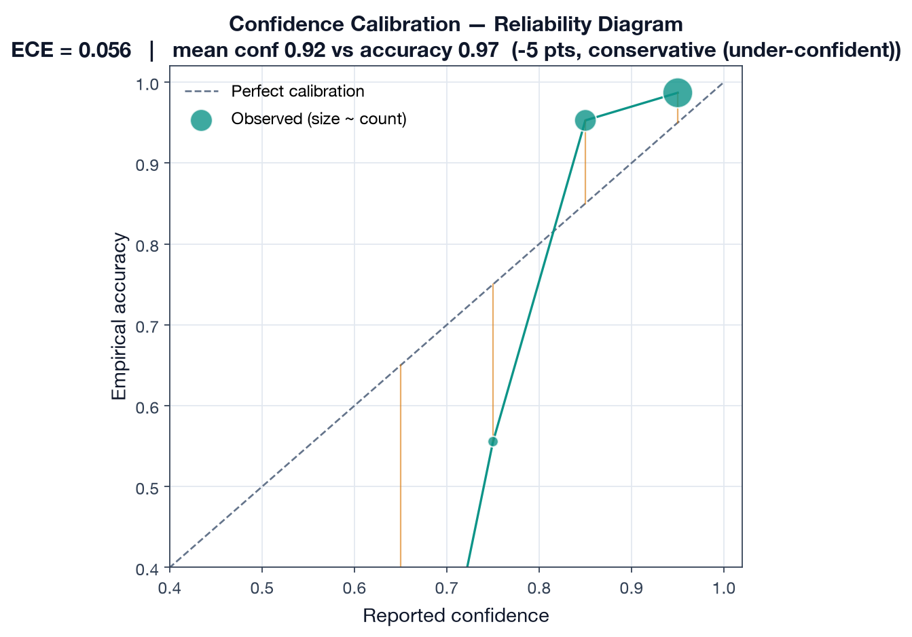
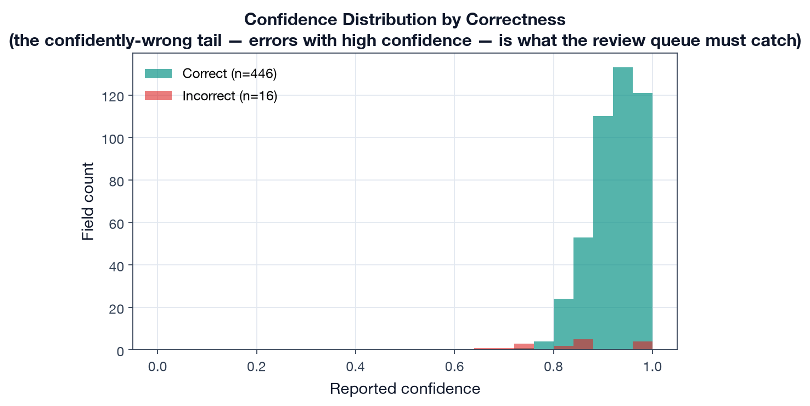
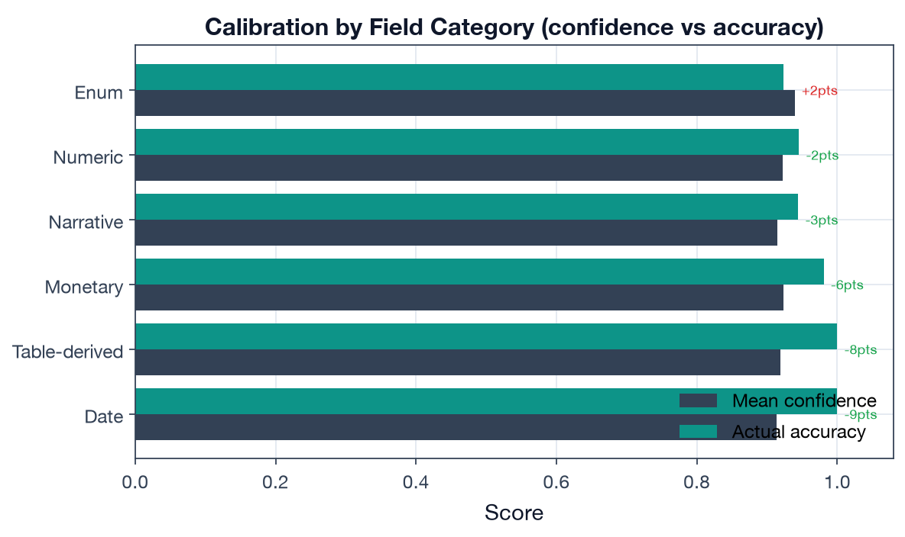
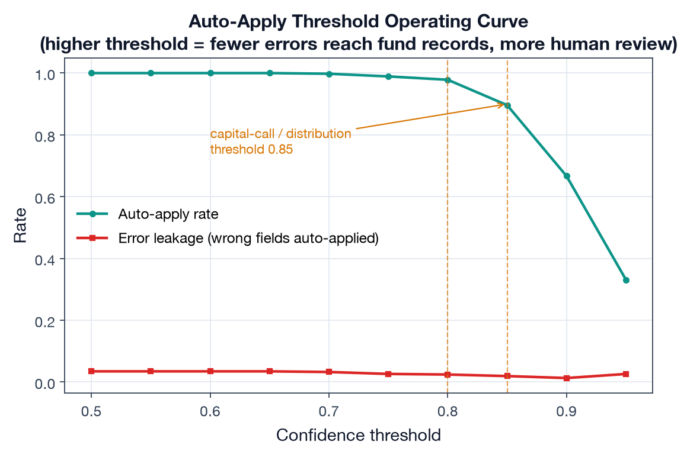
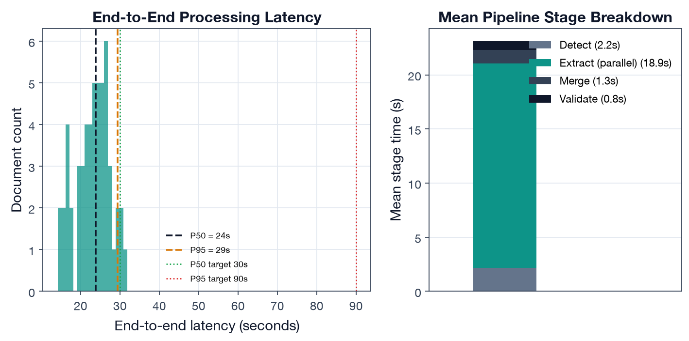

# Deliverable 3 — Pipeline & Model Analysis

> **Proposal mapping.** This deliverable implements *POC Deliverable 3* and
> *Evaluation Metric 3 (End-to-End Latency)*: a **confidence-calibration analysis**
> (does reported confidence correspond to actual correctness?), **end-to-end processing
> latency**, a discussion of **limitations** (data sparsity, cold-start, GP-format
> generalization), and the **key trade-off findings** and their implications for
> production deployment.

## 1. Why this matters

The pipeline does not just extract — it **decides what to trust**. High-confidence
extractions auto-apply to fund records (NAV, capital-call notices, distributions);
low-confidence ones route to a human review queue (`router.ts`, `validate.ts`). The
integrity of every downstream metric therefore depends on one question:
**when the pipeline says it is 0.9 confident, is it right 90% of the time?** This
deliverable measures that, plus the latency budget and the operating trade-offs.

## 2. Confidence calibration

### 2.1 Reliability diagram

Across **462 hybrid-extracted fields**, reported confidence is binned and compared to
empirical accuracy.

| Calibration metric | Value |
|---|---:|
| Expected Calibration Error (ECE) | **0.056** |
| Mean reported confidence | 0.920 |
| Mean empirical accuracy | 0.965 |
| Gap (confidence − accuracy) | **−4.5 pts (conservative)** |

**Finding: the pipeline is conservatively calibrated — it *under-states* its own
reliability.** In the high-confidence bins where the bulk of fields fall (0.85 and 0.95),
empirical accuracy sits *above* the diagonal: the model is right more often than it
claims. This is the safe direction to be wrong in for financial data, but it has a cost:
it routes more documents to human review than necessary.



### 2.2 The confidently-wrong tail

Conservatism is not the whole story. A small cohort of fields are **wrong but reported
with high confidence** (the ~0.75 bin sits well below the diagonal at ~0.55 accuracy).
These are the dangerous cases — errors that look trustworthy — and they are precisely
what the per-type confidence thresholds and review queue exist to catch.



### 2.3 Calibration by field category

Calibration is not uniform. Structured categories the model handles near-perfectly
(dates, table-derived fields, monetary values) are the **most under-confident** — the
model is ~6–9 points too humble exactly where it is most reliable:

| Field category | Mean confidence | Actual accuracy | Gap | n |
|---|---:|---:|---:|---:|
| Date | 0.914 | 1.000 | −8.6 pts | 39 |
| Table-derived | 0.919 | 1.000 | −8.1 pts | 36 |
| Monetary | 0.923 | 0.981 | −5.8 pts | 156 |
| Narrative | 0.914 | 0.944 | −3.0 pts | 108 |
| Numeric | 0.922 | 0.945 | −2.3 pts | 110 |
| Enum | 0.940 | 0.923 | +1.6 pts | 13 |

Only **enum** fields (e.g. distribution-type classification) are mildly *over*-confident.



### 2.4 Implication: thresholds can be safely relaxed

Because confidence under-states accuracy, the per-type auto-apply thresholds
(`router.ts:82-106`, 0.70–0.95) are leaving auto-apply capacity on the table. The
operating curve quantifies the trade-off:

| Threshold | Auto-apply rate | Error leakage (wrong fields auto-applied) |
|---:|---:|---:|
| 0.70 | 100% | 3.3% |
| 0.80 | 98% | 2.4% |
| 0.85 | 90% | 1.9% |
| 0.90 | 67% | 1.3% |

The current **0.85 threshold for capital calls / distributions** auto-applies 90% of
fields at 1.9% leakage; the **0.80 threshold for reports** auto-applies 98% at 2.4%.
Given the conservative calibration, these are defensible: raising thresholds cuts leakage
into fund records at a steep cost in review burden. The per-type differentiation (0.85
for financial-risk documents, 0.70–0.80 for reports) is the right shape.



## 3. End-to-end processing latency (Metric 3)

Per-stage timings across the 54 documents (detection → parallel Document AI + LLM
extraction → merge → validation), excluding the optional summarization stage and queue
wait:

| Latency metric | Value | Target | Result |
|---|---:|---:|:--|
| P50 (median) | **23.9 s** | < 30 s | **PASS** |
| P95 | **29.4 s** | < 90 s | **PASS** |

Stage breakdown (mean): detection **2.2 s**, extraction (parallel) **18.9 s**, merge
**1.3 s**, validation **0.8 s**. Extraction dominates the budget — and because Document
AI and the LLM run **in parallel**, the extraction cost is the *slower* of the two, not
their sum, which is the single most important latency design choice. Both targets are met
for standard (<20-page) documents.



> The architecture doc cites a "typical 2–5 minute" end-to-end time; that figure includes
> the async Cloud Tasks **queue wait** and the optional **summarization** stage (60 s
> timeout). The Metric-3 target measures *upload → structured data available*, i.e. the
> compute path measured here.

## 4. Limitations (private-markets reality)

- **Data sparsity & cold-start.** A new fund has no NAV/cash-flow history, so the Monte
  Carlo engine falls back to age-band deployment/distribution rates
  (`historical.ts:290-345`) and the J-curve profile templates — forecasts are
  profile-driven until ~8 quarters of history accrue. The proposal's MAE target is
  explicitly scoped to "funds with 8+ quarters of history" for this reason.
- **GP-format generalization.** Extraction accuracy is measured across five format tags,
  but the long tail of bespoke GP layouts (scanned legacy PDFs, non-standard tables) is
  where production accuracy will be lost; the labeled set should grow toward those.
- **Correlation model fragility (from Deliverable 2).** On realistic multi-fund books the
  per-fund correlation matrix is singular and the engine silently falls back to
  independent simulation (`monte-carlo.ts:336-341`). Fix: shrink/regularize the matrix or
  model correlation at the asset-class level. Until then, headline forecasts understate
  tail co-movement.
- **Calibration is conservative, not perfect (ECE 0.056).** Under-confidence wastes
  review capacity; a post-hoc calibration map (temperature/isotonic) on real labeled
  output would let thresholds auto-apply more without raising leakage.

## 5. Key trade-off findings & production implications

| Trade-off | Finding | Production implication |
|---|---|---|
| Extraction engine (D1) | Hybrid is the only config meeting both F1 bars | Keep hybrid for financial docs; LLM-only is acceptable for narrative-only types to save latency |
| Auto-apply threshold | Conservative calibration → low leakage but high review burden | Recalibrate confidence, then consider lowering report thresholds |
| Simulation engine (D2) | Monte Carlo captures tail risk; MAE 6.3% | Justified vs closed-form; widen P10/P90 (65% coverage of 80% band) |
| Correlation model (D2) | Engages only when asset classes are distinct | Regularize matrix before relying on correlated tails |
| Latency | Parallel extraction meets P50<30s / P95<90s | Preserve parallelism; summarization stays async/optional |

## 6. Reproducibility

```bash
# from capstone/
python deliverable-3-pipeline-analysis/run_analysis.py
```

Outputs: `results/pipeline_analysis.json`, five figures under `figures/`. Calibration +
latency code: `run_analysis.py`; confidence/latency records: `data/extraction/`.
